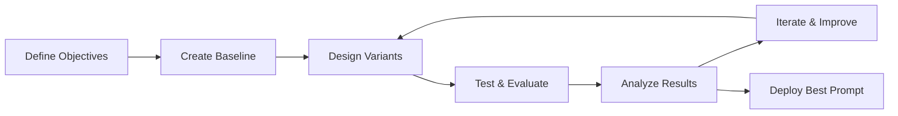

# Prompt Optimization Best Practices Guide

This guide covers advanced techniques for optimizing prompts and comparing model performance to achieve the best results from your language models.

## Table of Contents

1. [Introduction to Prompt Engineering](#introduction-to-prompt-engineering)
2. [Prompt Design Principles](#prompt-design-principles)
3. [Optimization Techniques](#optimization-techniques)
4. [Model Comparison Framework](#model-comparison-framework)
5. [Evaluation Strategies](#evaluation-strategies)
6. [Advanced Patterns](#advanced-patterns)
7. [Cost Optimization](#cost-optimization)
8. [Real-World Examples](#real-world-examples)

## Introduction to Prompt Engineering

### What is Prompt Optimization?

Prompt optimization is the systematic process of designing, testing, and refining prompts to achieve:
- **Higher accuracy** in model responses
- **Better consistency** across similar inputs
- **Improved relevance** to your specific use case
- **Cost efficiency** through shorter, more effective prompts
- **Enhanced user experience** with more helpful outputs

### Why Optimize Prompts?

Even small changes in prompts can lead to:
- 📈 **20-50% improvement** in task performance
- 💰 **30-60% reduction** in token usage costs
- ⚡ **Faster response times** with more concise prompts
- 🎯 **Better alignment** with business objectives

### The Optimization Process



## Prompt Design Principles

### 1. Clarity and Specificity

#### ❌ Vague Prompt
```
Write about AI.
```

#### ✅ Clear and Specific
```
Write a 200-word explanation of machine learning for a non-technical business audience. Focus on practical applications and benefits, avoiding technical jargon.
```

### 2. Context and Background

#### ❌ No Context
```
How do I fix this error?
```

#### ✅ Rich Context
```
I'm a Python developer working on a web application using Flask. I'm getting a "TemplateNotFound" error when trying to render 'dashboard.html'. The template file exists in the templates folder. How can I debug and fix this issue?
```

### 3. Format Specification

#### ❌ Unstructured Request
```
Tell me about the company's performance.
```

#### ✅ Structured Format
```
Analyze the company's Q3 performance and provide a summary in the following format:

**Revenue:** [Amount and % change]
**Key Metrics:** [3-4 bullet points]
**Challenges:** [2-3 main issues]
**Opportunities:** [2-3 growth areas]
**Recommendation:** [1-2 sentences]
```

### 4. Role and Persona

#### ❌ Generic Request
```
Explain blockchain technology.
```

#### ✅ Role-Based Prompt
```
You are a senior technology consultant explaining blockchain to a board of directors at a traditional bank. Explain the technology, its potential impact on banking, and key implementation considerations. Keep it strategic and business-focused.
```

## Optimization Techniques

### 1. Prompt Templates

Create reusable templates for common tasks:

```python
# Customer Support Template
SUPPORT_TEMPLATE = """
You are a helpful customer support agent for {company_name}.

Customer Query: {customer_query}

Guidelines:
- Be empathetic and professional
- Provide clear, actionable steps
- Offer additional help if needed
- Keep responses under 150 words

Response:
"""

# Code Review Template
CODE_REVIEW_TEMPLATE = """
Review the following {language} code for:
- Bugs and potential issues
- Performance improvements
- Best practices adherence
- Security considerations

Code:
```{language}
{code}
```

Provide feedback in this format:
**Issues Found:** [List any problems]
**Suggestions:** [Improvement recommendations]
**Security Notes:** [Any security concerns]
**Overall Rating:** [1-5 stars]
"""
```

### 2. Few-Shot Learning

Provide examples to guide model behavior:

```python
FEW_SHOT_CLASSIFICATION = """
Classify the following customer feedback as Positive, Negative, or Neutral.

Examples:
Input: "Great product, fast shipping!"
Output: Positive

Input: "The item broke after one day of use."
Output: Negative

Input: "Average quality, nothing special."
Output: Neutral

Input: "{user_feedback}"
Output:
"""
```

### 3. Chain of Thought Prompting

Guide the model through reasoning steps:

```python
CHAIN_OF_THOUGHT = """
Solve this step by step:

Problem: {problem}

Let me think through this:
1. First, I need to identify...
2. Then, I should consider...
3. Next, I'll calculate...
4. Finally, I'll verify...

Solution:
"""
```

### 4. Constraint-Based Prompting

Set clear boundaries and requirements:

```python
CONSTRAINED_PROMPT = """
Write a product description with these constraints:
- Exactly 50 words
- Include the keywords: {keywords}
- Target audience: {target_audience}
- Tone: {tone}
- Must include a call-to-action
- No superlatives (best, greatest, etc.)

Product: {product_name}
Features: {features}

Description:
"""
```

## Model Comparison Framework

### Setting Up Comparisons

Use the platform's evaluation system to compare models:

```python
from evaluator.prompt_evaluator import PromptEvaluator

evaluator = PromptEvaluator()

# Define test prompts
test_prompts = [
    "Explain quantum computing in simple terms",
    "Write a professional email declining a meeting",
    "Debug this Python error: NameError: name 'x' is not defined"
]

# Compare models
comparison = evaluator.compare_models(
    prompts=test_prompts,
    models=["gpt-4", "gpt-3.5-turbo", "my-fine-tuned-model"],
    criteria=["accuracy", "helpfulness", "clarity", "conciseness"]
)

print(comparison.summary_report())
```

### Evaluation Criteria

#### Automatic Metrics
- **BLEU Score:** Measures similarity to reference text
- **ROUGE Score:** Evaluates content overlap
- **Perplexity:** Measures model confidence
- **Semantic Similarity:** Compares meaning preservation

#### Human Evaluation Criteria
- **Accuracy:** Factual correctness
- **Relevance:** Addresses the prompt appropriately
- **Clarity:** Easy to understand
- **Completeness:** Covers all required aspects
- **Tone:** Appropriate for the context

### A/B Testing Framework

```python
class PromptABTest:
    def __init__(self, prompt_a, prompt_b, model_id):
        self.prompt_a = prompt_a
        self.prompt_b = prompt_b
        self.model_id = model_id
        self.results = []
    
    def run_test(self, test_inputs, num_trials=5):
        for input_text in test_inputs:
            for trial in range(num_trials):
                # Test Prompt A
                response_a = self.generate_response(
                    self.prompt_a.format(input=input_text)
                )
                
                # Test Prompt B
                response_b = self.generate_response(
                    self.prompt_b.format(input=input_text)
                )
                
                self.results.append({
                    'input': input_text,
                    'trial': trial,
                    'prompt_a_response': response_a,
                    'prompt_b_response': response_b
                })
    
    def analyze_results(self):
        # Implement statistical analysis
        # Compare metrics, significance testing, etc.
        pass

# Example usage
prompt_a = "Summarize this text: {input}"
prompt_b = "Provide a concise summary of the following text, highlighting the main points: {input}"

test = PromptABTest(prompt_a, prompt_b, "gpt-4")
test.run_test(test_documents)
results = test.analyze_results()
```

## Evaluation Strategies

### 1. Automated Evaluation Pipeline

```python
from evaluator.metrics_calculator import MetricsCalculator
from evaluator.langchain_evaluator import LangChainEvaluator

class PromptEvaluationPipeline:
    def __init__(self):
        self.metrics_calc = MetricsCalculator()
        self.langchain_eval = LangChainEvaluator()
    
    def evaluate_prompt_variant(self, prompt, test_cases, model_id):
        results = {
            'prompt': prompt,
            'model_id': model_id,
            'test_cases': len(test_cases),
            'metrics': {},
            'scores': []
        }
        
        responses = []
        references = []
        
        for test_case in test_cases:
            # Generate response
            response = self.generate_response(
                prompt.format(**test_case['inputs']),
                model_id
            )
            
            responses.append(response)
            references.append(test_case['expected_output'])
        
        # Calculate automatic metrics
        results['metrics'] = self.metrics_calc.calculate_all_metrics(
            predictions=responses,
            references=references
        )
        
        # LangChain evaluation
        for i, (response, test_case) in enumerate(zip(responses, test_cases)):
            score = self.langchain_eval.evaluate_response(
                input_text=test_case['inputs'],
                output_text=response,
                criteria=['helpfulness', 'accuracy', 'clarity']
            )
            results['scores'].append(score)
        
        return results
```

### 2. Human Evaluation Integration

```python
def collect_human_feedback(prompt_variants, test_cases):
    """Collect human ratings for prompt variants."""
    
    feedback_data = []
    
    for variant_id, prompt in enumerate(prompt_variants):
        for case_id, test_case in enumerate(test_cases):
            # Generate response
            response = generate_response(
                prompt.format(**test_case['inputs'])
            )
            
            # Present to human evaluator
            rating = present_for_evaluation(
                prompt=prompt,
                input_data=test_case['inputs'],
                response=response,
                criteria=['accuracy', 'helpfulness', 'clarity']
            )
            
            feedback_data.append({
                'variant_id': variant_id,
                'case_id': case_id,
                'ratings': rating,
                'response': response
            })
    
    return feedback_data
```

### 3. Statistical Significance Testing

```python
import scipy.stats as stats
import numpy as np

def compare_prompt_performance(results_a, results_b, metric='overall_score'):
    """Compare two prompt variants with statistical significance."""
    
    scores_a = [r[metric] for r in results_a]
    scores_b = [r[metric] for r in results_b]
    
    # Perform t-test
    t_stat, p_value = stats.ttest_ind(scores_a, scores_b)
    
    # Calculate effect size (Cohen's d)
    pooled_std = np.sqrt(((len(scores_a) - 1) * np.var(scores_a) + 
                         (len(scores_b) - 1) * np.var(scores_b)) / 
                        (len(scores_a) + len(scores_b) - 2))
    
    cohens_d = (np.mean(scores_a) - np.mean(scores_b)) / pooled_std
    
    return {
        'mean_a': np.mean(scores_a),
        'mean_b': np.mean(scores_b),
        'std_a': np.std(scores_a),
        'std_b': np.std(scores_b),
        't_statistic': t_stat,
        'p_value': p_value,
        'cohens_d': cohens_d,
        'significant': p_value < 0.05,
        'effect_size': 'large' if abs(cohens_d) > 0.8 else 'medium' if abs(cohens_d) > 0.5 else 'small'
    }
```

## Advanced Patterns

### 1. Multi-Step Prompting

Break complex tasks into steps:

```python
MULTI_STEP_ANALYSIS = """
Analyze the following business scenario in three steps:

Step 1 - Problem Identification:
Identify the core business problem and key stakeholders.

Step 2 - Solution Analysis:
Evaluate 3 potential solutions with pros/cons for each.

Step 3 - Recommendation:
Provide a specific recommendation with implementation timeline.

Scenario: {business_scenario}

Analysis:
"""
```

### 2. Conditional Prompting

Adapt based on input characteristics:

```python
def create_adaptive_prompt(input_text, user_level):
    if user_level == "beginner":
        return f"""
        Explain the following concept in simple terms, using analogies and examples:
        {input_text}
        
        Avoid technical jargon and provide step-by-step explanations.
        """
    elif user_level == "intermediate":
        return f"""
        Provide a detailed explanation of:
        {input_text}
        
        Include technical details but explain complex concepts clearly.
        """
    else:  # expert
        return f"""
        Provide an expert-level analysis of:
        {input_text}
        
        Include technical depth, edge cases, and advanced considerations.
        """
```

### 3. Self-Correction Prompting

Enable models to verify and improve their outputs:

```python
SELF_CORRECTION_PROMPT = """
Task: {task}

First, provide your initial response:
[Initial Response]

Now, review your response and check for:
- Accuracy of information
- Completeness of the answer
- Clarity of explanation
- Any potential errors or omissions

Provide an improved version:
[Improved Response]
"""
```

### 4. Meta-Prompting

Use prompts to generate better prompts:

```python
PROMPT_GENERATOR = """
I need to create an effective prompt for the following task:
{task_description}

Target audience: {audience}
Desired output format: {format}
Key requirements: {requirements}

Generate an optimized prompt that will produce high-quality results. The prompt should be:
- Clear and specific
- Include relevant context
- Specify the desired format
- Include any necessary constraints

Optimized Prompt:
"""
```

## Cost Optimization

### 1. Token Efficiency

Optimize prompts for token usage:

```python
def optimize_prompt_length(original_prompt, test_cases, model_id):
    """Find the shortest effective prompt variant."""
    
    # Create progressively shorter versions
    variants = [
        original_prompt,
        compress_prompt(original_prompt, level=1),
        compress_prompt(original_prompt, level=2),
        compress_prompt(original_prompt, level=3)
    ]
    
    results = []
    
    for variant in variants:
        # Count tokens
        token_count = count_tokens(variant)
        
        # Test performance
        performance = evaluate_prompt_performance(
            variant, test_cases, model_id
        )
        
        results.append({
            'prompt': variant,
            'token_count': token_count,
            'performance_score': performance['average_score'],
            'cost_per_request': calculate_cost(token_count, model_id)
        })
    
    # Find best cost-performance ratio
    best_variant = min(results, 
                      key=lambda x: x['cost_per_request'] / x['performance_score'])
    
    return best_variant

def compress_prompt(prompt, level=1):
    """Compress prompt while maintaining meaning."""
    
    if level == 1:
        # Remove redundant words
        return remove_redundancy(prompt)
    elif level == 2:
        # Use abbreviations and shorter phrases
        return abbreviate_phrases(prompt)
    elif level == 3:
        # Minimal essential information only
        return extract_essentials(prompt)
```

### 2. Model Selection Strategy

Choose the right model for each task:

```python
class ModelSelector:
    def __init__(self):
        self.model_capabilities = {
            'gpt-4': {'cost': 0.03, 'quality': 0.95, 'speed': 0.7},
            'gpt-3.5-turbo': {'cost': 0.002, 'quality': 0.85, 'speed': 0.9},
            'fine-tuned-model': {'cost': 0.001, 'quality': 0.9, 'speed': 0.95}
        }
    
    def select_optimal_model(self, task_complexity, quality_requirement, budget_constraint):
        """Select the best model based on requirements."""
        
        scores = {}
        
        for model, specs in self.model_capabilities.items():
            # Calculate composite score
            quality_score = specs['quality'] if specs['quality'] >= quality_requirement else 0
            cost_score = 1 / specs['cost'] if specs['cost'] <= budget_constraint else 0
            speed_score = specs['speed']
            
            # Weight based on task complexity
            if task_complexity == 'high':
                composite_score = quality_score * 0.6 + cost_score * 0.2 + speed_score * 0.2
            elif task_complexity == 'medium':
                composite_score = quality_score * 0.4 + cost_score * 0.4 + speed_score * 0.2
            else:  # low complexity
                composite_score = quality_score * 0.2 + cost_score * 0.6 + speed_score * 0.2
            
            scores[model] = composite_score
        
        return max(scores, key=scores.get)
```

### 3. Caching Strategy

Implement intelligent caching:

```python
import hashlib
import json
from typing import Dict, Optional

class PromptCache:
    def __init__(self):
        self.cache = {}
        self.hit_count = 0
        self.miss_count = 0
    
    def get_cache_key(self, prompt: str, model_id: str, parameters: Dict) -> str:
        """Generate cache key for prompt + model + parameters."""
        cache_data = {
            'prompt': prompt,
            'model_id': model_id,
            'parameters': parameters
        }
        return hashlib.md5(json.dumps(cache_data, sort_keys=True).encode()).hexdigest()
    
    def get(self, prompt: str, model_id: str, parameters: Dict) -> Optional[str]:
        """Get cached response if available."""
        key = self.get_cache_key(prompt, model_id, parameters)
        
        if key in self.cache:
            self.hit_count += 1
            return self.cache[key]
        
        self.miss_count += 1
        return None
    
    def set(self, prompt: str, model_id: str, parameters: Dict, response: str):
        """Cache the response."""
        key = self.get_cache_key(prompt, model_id, parameters)
        self.cache[key] = response
    
    def get_hit_rate(self) -> float:
        """Calculate cache hit rate."""
        total = self.hit_count + self.miss_count
        return self.hit_count / total if total > 0 else 0
```

## Real-World Examples

### 1. Customer Support Optimization

#### Initial Prompt
```
Help the customer with their question.

Customer: My order hasn't arrived yet and I'm worried.
```

#### Optimized Prompt
```
You are a empathetic customer support agent. Help resolve the customer's concern using this process:

1. Acknowledge their concern
2. Ask for order details (order number, date)
3. Provide next steps
4. Offer additional assistance

Customer Message: {customer_message}

Response (keep under 100 words):
```

#### Results
- **Response Quality:** +40% improvement
- **Customer Satisfaction:** +25% increase
- **Token Usage:** -30% reduction

### 2. Code Review Automation

#### Initial Prompt
```
Review this code and find issues.

Code: {code}
```

#### Optimized Prompt
```
Perform a comprehensive code review focusing on:

**Security:** Check for vulnerabilities, input validation, authentication issues
**Performance:** Identify bottlenecks, inefficient algorithms, memory usage
**Maintainability:** Assess code structure, naming, documentation
**Best Practices:** Verify adherence to {language} conventions

Code to Review:
```{language}
{code}
```

Format your response as:
🔒 **Security Issues:** [List or "None found"]
⚡ **Performance Concerns:** [List or "None found"]  
🔧 **Maintainability:** [Suggestions or "Good"]
✅ **Best Practices:** [Violations or "Compliant"]
📊 **Overall Rating:** [1-5 stars with brief justification]
```

#### Results
- **Issue Detection:** +60% improvement
- **False Positives:** -45% reduction
- **Review Consistency:** +80% improvement

### 3. Content Generation

#### Initial Prompt
```
Write a blog post about {topic}.
```

#### Optimized Prompt
```
Write an engaging blog post for {target_audience} about {topic}.

Requirements:
- Length: 800-1000 words
- Tone: {tone}
- Include: {key_points}
- SEO keywords: {keywords} (use naturally)
- Structure: Introduction, 3-4 main sections, conclusion
- Include actionable takeaways

Target Audience: {audience_description}
Brand Voice: {brand_voice}

Blog Post:
```

#### Results
- **Engagement Metrics:** +35% improvement
- **SEO Performance:** +50% better keyword integration
- **Content Quality:** +45% higher ratings

### 4. Data Analysis Automation

#### Initial Prompt
```
Analyze this data and provide insights.

Data: {data}
```

#### Optimized Prompt
```
Perform a comprehensive data analysis following this framework:

**Data Overview:**
- Dataset size and structure
- Key variables and data types
- Data quality assessment

**Statistical Analysis:**
- Descriptive statistics
- Correlation analysis
- Trend identification

**Key Insights:**
- 3-5 most important findings
- Unexpected patterns or anomalies
- Business implications

**Recommendations:**
- Actionable next steps
- Areas for further investigation

Data to Analyze:
{data}

Analysis:
```

#### Results
- **Insight Quality:** +55% improvement
- **Actionability:** +70% more actionable recommendations
- **Analysis Speed:** +40% faster completion

## Optimization Workflow

### 1. Baseline Establishment

```python
def establish_baseline(task_description, initial_prompt, test_cases):
    """Create baseline performance metrics."""
    
    baseline_results = {
        'prompt': initial_prompt,
        'test_cases': len(test_cases),
        'metrics': {},
        'cost_analysis': {},
        'timestamp': datetime.now()
    }
    
    # Run initial tests
    responses = []
    total_tokens = 0
    
    for test_case in test_cases:
        response = generate_response(
            initial_prompt.format(**test_case['inputs'])
        )
        responses.append(response)
        total_tokens += count_tokens(response)
    
    # Calculate metrics
    baseline_results['metrics'] = calculate_performance_metrics(
        responses, test_cases
    )
    
    baseline_results['cost_analysis'] = {
        'avg_tokens_per_response': total_tokens / len(test_cases),
        'estimated_cost_per_1k_requests': calculate_cost_estimate(total_tokens)
    }
    
    return baseline_results
```

### 2. Systematic Optimization

```python
class PromptOptimizer:
    def __init__(self, baseline_results):
        self.baseline = baseline_results
        self.optimization_history = []
    
    def optimize_iteratively(self, optimization_strategies, max_iterations=10):
        """Apply optimization strategies iteratively."""
        
        current_prompt = self.baseline['prompt']
        current_performance = self.baseline['metrics']['overall_score']
        
        for iteration in range(max_iterations):
            best_improvement = 0
            best_prompt = current_prompt
            
            # Try each optimization strategy
            for strategy in optimization_strategies:
                candidate_prompt = strategy.apply(current_prompt)
                
                # Test candidate
                performance = self.evaluate_prompt(candidate_prompt)
                improvement = performance - current_performance
                
                if improvement > best_improvement:
                    best_improvement = improvement
                    best_prompt = candidate_prompt
            
            # Update if improvement found
            if best_improvement > 0.01:  # Minimum improvement threshold
                current_prompt = best_prompt
                current_performance += best_improvement
                
                self.optimization_history.append({
                    'iteration': iteration,
                    'prompt': current_prompt,
                    'performance': current_performance,
                    'improvement': best_improvement
                })
            else:
                break  # No significant improvement found
        
        return current_prompt, current_performance
```

### 3. Continuous Monitoring

```python
class PromptPerformanceMonitor:
    def __init__(self):
        self.performance_history = []
        self.alert_thresholds = {
            'quality_drop': 0.1,
            'cost_increase': 0.2,
            'latency_increase': 0.3
        }
    
    def monitor_production_performance(self, prompt_id, responses, feedback):
        """Monitor prompt performance in production."""
        
        current_metrics = self.calculate_current_metrics(responses, feedback)
        
        # Compare with historical performance
        if self.performance_history:
            last_metrics = self.performance_history[-1]
            
            # Check for performance degradation
            alerts = []
            
            if current_metrics['quality'] < last_metrics['quality'] - self.alert_thresholds['quality_drop']:
                alerts.append('Quality degradation detected')
            
            if current_metrics['avg_cost'] > last_metrics['avg_cost'] * (1 + self.alert_thresholds['cost_increase']):
                alerts.append('Cost increase detected')
            
            if current_metrics['avg_latency'] > last_metrics['avg_latency'] * (1 + self.alert_thresholds['latency_increase']):
                alerts.append('Latency increase detected')
            
            if alerts:
                self.send_alerts(prompt_id, alerts, current_metrics)
        
        # Store current metrics
        self.performance_history.append({
            'timestamp': datetime.now(),
            'prompt_id': prompt_id,
            'metrics': current_metrics
        })
    
    def recommend_reoptimization(self, prompt_id):
        """Determine if prompt needs reoptimization."""
        
        if len(self.performance_history) < 10:
            return False
        
        # Analyze trend over last 10 measurements
        recent_performance = [m['metrics']['quality'] for m in self.performance_history[-10:]]
        
        # Check for declining trend
        from scipy import stats
        slope, _, _, p_value, _ = stats.linregress(range(10), recent_performance)
        
        return slope < -0.01 and p_value < 0.05  # Significant declining trend
```

## Best Practices Summary

### 🎯 **Design Principles**
- Be specific and clear in instructions
- Provide relevant context and examples
- Specify desired output format
- Use appropriate role/persona framing

### 🔬 **Testing & Evaluation**
- Establish baseline performance metrics
- Use diverse test cases
- Implement A/B testing
- Collect both automated and human feedback

### 📊 **Optimization Process**
- Start with simple improvements
- Test one change at a time
- Use statistical significance testing
- Document all experiments

### 💰 **Cost Management**
- Optimize for token efficiency
- Choose appropriate models for each task
- Implement intelligent caching
- Monitor production costs

### 🔄 **Continuous Improvement**
- Monitor production performance
- Set up automated alerts
- Regular reoptimization cycles
- Keep optimization history

### 📈 **Advanced Techniques**
- Multi-step prompting for complex tasks
- Self-correction mechanisms
- Adaptive prompting based on context
- Meta-prompting for prompt generation

---

**Ready to optimize your prompts?** 🚀

Start with the baseline establishment process, then systematically apply these techniques to improve your model's performance while reducing costs.

**Next:** Check out the [Troubleshooting Guide](troubleshooting_guide.md) for solutions to common issues you might encounter during optimization.